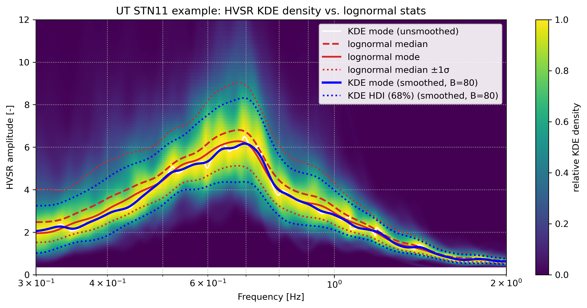
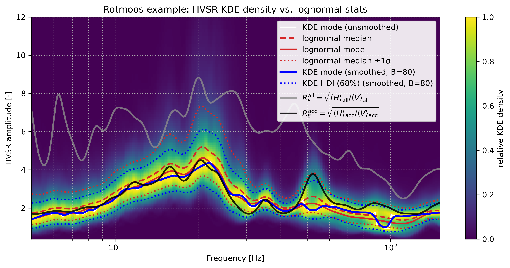

# *KDE-HVSR* Utilities and Example Figures


[](https://doi.org/10.5281/zenodo.18338881)

This repository contains utilities and example scripts for computing 
**HVSR amplitude statistics using kernel density estimation (KDE)** and 
**directional HVSR diagnostics** based on the eigen-decomposition of the 
horizontal spectral matrix. 

The methodology is introduced in the **article by** ***Kristek et al.*** (submitted to *Geophysical Journal International* in 2026).

The code provides:

- 1D KDE (mode + HDI) for HVSR amplitudes  
- 2D KDE density maps (frequency × amplitude)  
- directional diagnostics based on principal directions of horizontal ground motion  
- circular highest-density intervals (HDI) for azimuthal samples  
- Konno–Ohmachi smoothing utilities  
- fully reproducible example figures (**Fig2**, **Figs3&4**)  

The implementation processes multi-window HVSR and directional spectra derived from 3-component seismic recordings.

---

## Citation
If you use *KDE-HVSR* in your research, we ask you please cite the following:

> **Kristek, J., Kristekova, M. (2026)**
> KDE-HVSR Utilities (Version 1.0.0) [Computer software]. Zenodo. https://doi.org/10.5281/zenodo.18338882

> **Kristek, J., Kristekova, M., Moczo, P. (submitted in 2026)**  
> “Nonparametric mode statistics and directional spread of ambient-noise horizontal-to-vertical spectral ratios”
> Geophysical Journal International

---

## References to Implemented Work

*KDE-HVSR* use the publicly available *hvsrpy* package for standard HVSR processing and apply 
KDE-based post-processing on top of the same window-wise spectral ensembles. 
We strongly encourage users to cite also original *hvsrpy*:

> **Vantassel, J. P. (2025)**
> hvsrpy : An Open-Source Python Package for Microtremor and Earthquake Horizontal-to-Vertical Spectral Ratio Processing. 
> Seismological Research Letters, 96(4), 2671–2682.
> https://doi.org/10.1785/0220240395

> **Joseph Vantassel. (2020)**
> jpvantassel/hvsrpy: latest (Concept). Zenodo. http://doi.org/10.5281/zenodo.3666956

---

## Project Structure

```
hvsr-kde/
│
├── circular_kde_utils.py        # von Mises circular KDE
├── kde_utils.py                 # 1D KDE for amplitudes (shared logic)
│
├── Fig2.py                      # Example: KDE vs lognormal HVSR (UT STN11 example)
├── Figs3and4.py                 # Example: KDE HVSR + directional HVSR diagnostics (Rotmoos example)
│
├── UT.STN11.A2_C300.miniseed    # data for UT_STN11 example
├── reftek_3C.mseed              # data for Rotmoos_P1_475 example
│
├── README.md
├── CITATION.cff
└── LICENSE
```

---

## Dependencies

```bash
pip install numpy matplotlib scipy obspy hvsrpy
```

---

# 🔍 Methods – Short Overview

A nonparametric, KDE-based framework for summarizing window-wise HVSR amplitudes and directional ratios from ambient noise

## 1. HVSR KDE Statistics

By estimating the density in log space and transforming it back to the linear domain, we define the representative HVSR amplitude as the mode of the linear-domain density and quantify uncertainty with highest-density intervals. 
This makes the central curve and its uncertainty bands directly consistent with the linear HVSR axis while preserving the advantages of lognormal practice.

---

## 2. Directional HVSR Diagnostics

Directional information comes from the horizontal spectral matrix:

$$
\mathbf{M}_h(f_k)=
\begin{pmatrix}
S_{xx,w}(f_k) & C_{xy,w}(f_k) \\
C_{xy,w}(f_k) & S_{yy,w}(f_k)
\end{pmatrix},
$$

whose eigenvalues define:

$$
H_{\min,w}(f_k),\qquad H_{\max,w}(f_k).
$$

The corresponding azimuth is:

$$
\phi_w(f_k)=\frac{1}{2}\mathrm{atan2}\left(2C_{xy,w}(f_k),\; S_{xx,w}(f_k)-S_{yy,w}(f_k)\right).
$$

Directional HVSR envelopes:

$$
R_{\min,w}(f_k)=\sqrt{\frac{2H_{\min,w}(f_k)}{V_w(f_k)}},\qquad
R_{\max,w}(f_k)=\sqrt{\frac{2H_{\max,w}(f_k)}{V_w(f_k)}}.
$$

---

## 3. Directional azimuth uncertainty: von Mises circular KDE

Implemented in `circular_kde_utils.py` (`circular_kde_von_mises`).

At each frequency, the azimuth distribution is modeled as a **circular KDE using von Mises kernels**. The concentration parameter κ is estimated from the empirical mean resultant length, the dominant azimuth is given by the KDE mode, and the angular spread is obtained as a circular HDI of the KDE density.

This approach provides an explicit **smooth circular density model** of azimuthal variability.

### Interpretation of circular HDI values

Large values of circular HDI indicates that the horizontal energy is distributed over many directions. In contrast, a small values marks frequencies where the horizontal amplitude is strongly concentrated into one or two preferred azimuths, pointing to 2D/3D structure or persistent directional sources.

---

# 📊 Example Scripts

## Fig2.py — KDE vs lognormal HVSR (UT STN11)

Run:

```bash
python Fig2.py
```

Output: `Fig2_kde_lognormal_ut.png`



---

## Figs3and4.py — Directional HVSR (Rotmoos)

Run:

```bash
python Figs3and4.py
```

### Fig. 3 — HVSR KDE vs lognormal



---

### Fig. 4a — Angular spread Δφ₀.₆₈(f)


---

### Fig. 4b — Directional envelopes


---

### Fig. 4c — KDE of √(2Hmin/V) and √(2Hmax/V)


---

## Running All Examples

```bash
python Fig2.py
python Figs3and4.py
```

Make sure the example MSEED files  
`UT.STN11.A2_C300.miniseed` and `reftek_3C.mseed`  
are located at paths specified in the scripts.

---

## Questions?

Open an issue if you want to extend the analysis or figures.
